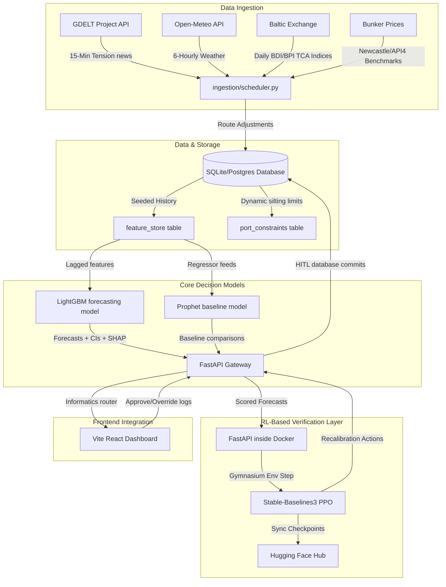
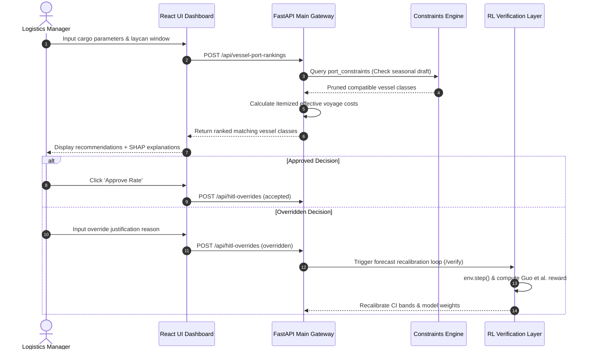

# Charter-IQ — Freight Forecasting & Vessel Matcher

**Charter-IQ** is a decision-support platform designed to assist bulk logistics managers at **SAIL** (Smart India Hackathon, Problem Statement 26006) in selecting freight strategies, matching vessel classes, and predicting voyage rates.

The application separates core predictive workloads from active evaluation, combining **Supervised Machine Learning models** (LightGBM/XGBoost + Prophet baseline) with a isolated **Reinforcement Learning-Based Verification & Optimization Layer** (FastAPI in Docker running Gymnasium + Stable-Baselines3 PPO).

---

## 1. System Architecture



---

## 2. Operational Functioning & HITL Decision Flow

Charter-IQ does **not** make autonomous chartering decisions or place freight orders. A human logistics manager remains the ultimate decision-maker via a mandatory **Human-in-the-Loop (HITL) Checkpoint**:



---

## 3. Directory Layout

```
├── /ingestion/            # Ingestion adapters + APScheduler cron
│   ├── fetch_external.py  # Connectors for GDELT, weather, BDI index
│   ├── route_adjustment.py# Daily Time Charter to voyage rate translator
│   └── scheduler.py       # Loop fetching parameters & seeding DB
├── /rules/                # Constraint vetting engine
│   └── engine.py          # Hard filters on draft/LOA/beam constraints
├── /forecasting/          # XGBoost/LightGBM forecaster & Prophet baseline
│   ├── train.py           # Model training pipeline
│   ├── predictor.py       # Inference, CI bootstrap & TreeSHAP explainers
│   └── hf_uploader.py     # Hugging Face Hub sync integrations
├── /matching/             # Vessel cost rankings
│   └── matcher.py         # Total effective cost calculation
├── /risk/                 # Port delay warnings
│   └── alerts.py          # Volatility z-scores & RED/AMBER/GREEN flags
├── /portfolio/            # Contract strategy
│   └── laddering.py       # Spot vs CoA quarterly schedules
├── /rl_verifier/          # Isolated verification layer microservice
│   ├── env.py             # Gymnasium calibration environment
│   ├── reward.py          # Guo et al. (2025) recalibration reward
│   ├── train_policy.py    # SB3 PPO policy model trainer
│   └── service.py         # FastAPI verification endpoints (Port 8001)
├── /api/                  # Unified database & REST API router
│   ├── db.py              # SQLAlchemy SQLite/PostgreSQL models
│   ├── seed.py            # Seeding seasonal constraints & fleet specs
│   └── main.py            # Main FastAPI server router (Port 8000)
├── /docker/               # Service container configurations
│   ├── api/Dockerfile     # Core API docker configurations
│   └── rl-verifier/       # RL-verifier microservice docker files
├── docker-compose.yml     # Orchestrates DB shared volume mapping
├── REQUIREMENTS.md        # Python dependency packages list
└── REFERENCES.md          # Scientific papers driving our algorithms
```

---

## 4. Setup and Run Instructions

### 4.1 Running with Docker Compose (Recommended)
This runs both the Core API Gateway (`8000`) and the RL Verification microservice (`8001`) with shared database storage volumes.

1. Ensure you have a `.env` in the root containing your Hugging Face Hub Token:
   ```env
   HF_TOKEN=your_hf_token_here
   ```
2. Build and boot the microservices:
   ```bash
   docker-compose up --build
   ```
3. Open `http://localhost:8000/docs` in your browser to view the interactive FastAPI Swagger UI.

### 4.2 Running Locally
1. Install Python dependencies:
   ```bash
   pip install -r requirements.txt
   ```
2. Seed the database with seasonal port draft restrictions:
   ```bash
   python api/seed.py
   ```
3. Start the Core API Gateway:
   ```bash
   python api/main.py
   ```
4. In a separate terminal shell, boot the RL Verification microservice:
   ```bash
   python rl_verifier/service.py
   ```

### 4.3 Running React Frontend Dashboard
1. Install node dependencies:
   ```bash
   npm install
   ```
2. Start the Vite React development server:
   ```bash
   npm run dev
   ```
3. Open the portal at the URL printed in the terminal (typically `http://localhost:5173`).
